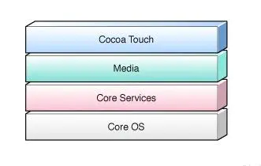
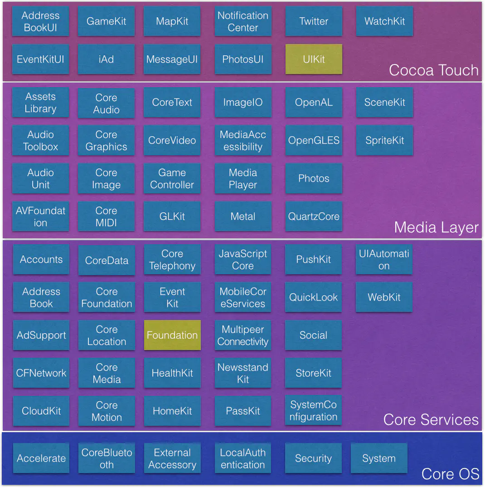

# apple 的系统
经过历史的几次变迁, Darwin 是苹果家系统的内核了. 苹果也开源过 Darwin。所以，没有mac设备，也不是完全不能给苹果写程序的。同样，就算实现了也是半残疾，很多MacOS的特性是调用不到的。
> 现状：
> https://en.wikipedia.org/wiki/Darwin_%28operating_system%29
> 
> * 苹果官方的内核 https://github.com/apple/darwin-xnu
> * 正式一些的项目是OpenDarwin，随着越来越封闭的mac系统，这个项目06年的时候已经停滞了
> * 还有个PureDarwin https://github.com/PureDarwin/PureDarwin 可以跑到quem虚拟机上。

基于Darwin基础，苹果分裂出几个系统分之，MacOS，iOS，tvOS，watchOS，等等。总之，苹果家的系统，都是自己的。而且还是软硬结合一体的。
> 对于黑苹果的一些看法。
> 
> 鉴于苹果系统的封闭性，随着近年来软硬一体的集合，2021年左右第一款arm芯片的笔记本。还有早已接管了bios的T2芯片。普通电脑硬件安装苹果的成本越发的高了。推荐还是直接购买

# 开发工具与语言。
苹果开发，Mac是必不可少的。所有标榜跨平台实现的技术途径。最后一定是需要Mac来进行最后编译的。不要脑残，不要脑残，不要脑残。

苹果从3方面把控着软件开发。
1. 软硬一体的设备
2. 基于封闭系统，苹果有一套证书机制，很多功能开发需要苹果的开发证书授权，设备才能提供功能
3. 自成一体的程序格式、开发语言、开发工具。
    * Mach-O格式的可执行文件
    * Objective-c，swift
    * xcode

# MacOS
暂无
# iOS 架构



## 1. 触摸层（Cocoa Touch）-- 界面、触摸、一般app开发

为应用程序开发提供了各种常用的框架并且大部分框架与界面有关，本质上来说它负责用户在iOS设备上的触摸交互操作。如NotificationCenter的本地通知和远程推送服务，iAd广告框架，GameKit游戏工具框架，消息UI框架，图片UI框架，地图框架等等。

下面看几个重要的框架：
```
AddressBook.framework：包含直接访问用户联系人数据库的函数。
AddressBookUI.framework：包含显示系统定义的联系人挑选界面和编辑界面的类。
EventKit.framework：包含访问用户日历事件数据的接口。
EventKitUI.framework：包含显示标准系统日历界面的类。
GameKit.framework：包含点对点连接管理接口。
iAd.framework：包含在应用程序中显示广告的类。
MapKit.framework：包含将地图界面嵌入到应用程序的类，也可以用于查找地理编码反向坐标。
MessageUI.framework：包含撰写和排队发送电子邮件信息的界面。
UIKit.framework：包含iOS应用程序用户界面层使用的类和方法。
```

## 2. 媒体层（Media）-- 音频视频，图像，播放器等基础封装

提供应用中视听方面的技术，如图形图像相关的CoreGraphics、CoreImage、GLKit、OpenGL ES、CoreText、ImageIO等等。声音技术相关的CoreAudio、OpenAL、AVFoundation，视频相关的CoreMedia、Media Player框架，音视频传输的AirPlay框架等等。

下面看其中几个重要的框架：
```
AssetsLibrary.framework：包含显示用户照片和视频的类。
AudioToolbox.framework：包含处理音频流数据以及播放或录制音频的接口。
AudioUnit.framework：包含加载并使用音频单元的接口。
AVFoundation.framework：包含播放或录制音频的Objective-C接口。
CoreAudio.framework：包含Core Audio框架使用的各种数据类型。
CoreGraphics.framework：包含Quartz 2D接口。
ImageIO.framework：包含读取或写入图像数据的类。
MediaPlayer.framework：包含显示全屏视频的接口。
OpenAL.framework：包含OpenAL接口。OpenAL是一个跨平台的方位音频库。
OpenGLES.framework：包含OpenGL ES接口。OpenGL ES框架是OpenGL跨平台2D和3D渲染库的跨平台版本。
QuartzCore.framework：包含Core Animation接口。
```

## 3. Core Services（核心服务层） -- 数据，文件与网络，都是底层服务了。

提供给应用所需要的基础的系统服务。如Accounts账户框架，广告框架，数据存储框架，网络连接框架，地理位置框架，运动框架等等。这些服务中的最核心的是CoreFoundation和Foundation框架，定义了所有应用使用的数据类型。

下面看几个重要的框架：
```
CFNetwork.framework：包含通过WiFi或者蜂窝无线访问网络的接口。
CoreData.framework：包含管理应用程序数据模型的接口。
CoreFoundation.framework：提供一些基本软件服务，包括常见数据类型抽象、字符串实用工具、群体类型实用工具、资源管理以及偏好设置。
CoreLocation.framework：包含确定用户方位信息的接口。
CoreMedia.framework：包含操作音频和视频的底层例程。
CoreMotion.framework：包含访问加速度计以及陀螺仪的数据的接口。
CoreTelephony.framework：包含访问电话相关的信息的例程。
CoreVideo.framework：包含操作音频和视频的底层例程。请不要直接使用该框架。
Foundation.framework：包含Cocoa Foundation层的类和方法。
MobileCoreServices.framework：定义系统支持的统一类型标识符（UTIs）
QuickLook.framework：包含预览文件接口。
StoreKit.framework：包含用于处理与应用程序内购买相关的财务交易。
SystemConfiguration.framework：包含用于处理设备网络配置的接口。
```

## 4. 核心操作系统层（Core OS）-- 多数碰到硬件了。最为底层。

包含大多数低级别接近硬件的功能，它所包含的框架常常被其它框架所使用。Accelerate框架包含数字信号，线性代数，图像处理的接口。针对所有的iOS设备硬件之间的差异做优化，保证写一次代码在所有iOS设备上高效运行。CoreBluetooth框架利用蓝牙和外设交互，包括扫描连接蓝牙设备，保存连接状态，断开连接，获取外设的数据或者给外设传输数据等等。Security框架提供管理证书，公钥和私钥信任策略，keychain,hash认证数字签名等等与安全相关的解决方案。

下面看其中几个比较重要的框架：
```
Accelerate.framework：包含加速数学和DSP函数。
ExternalAccessory.framework：包含与外设进行通讯的接口。
Security.framework：包含管理证书、公钥私钥以及信任策略的接口。
```


