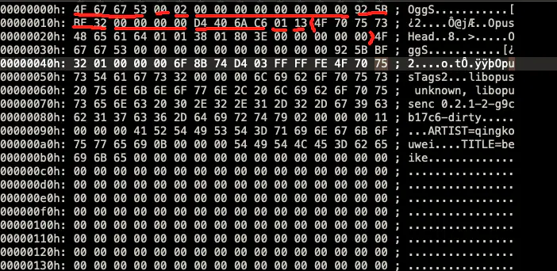
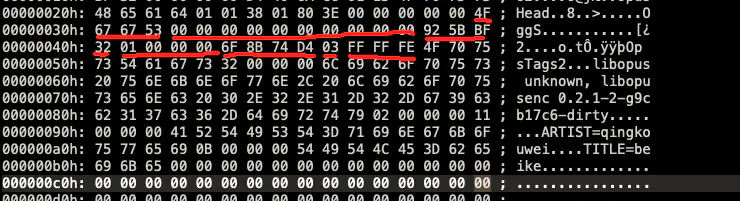
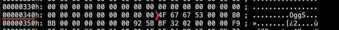

# OggOpus 封装格式

> 首先，需要了解 ogg 封包格式 [goto](../ogg/index.md)

|Hex|Desc|
|---|---|
|0x4F 0x67 0x67 0x53|OggS 包头|
|0x00|版本，默认0|
|0x02|本页类型，02是开头|
|0x00 0x00 0x00 0x00 0x00 0x00 0x00 0x00|granule_position：媒体编码相关的参数信息,表示到本页为止逻辑流有 0 个采样|
|0x92 0x5B 0xBF 0x32|当前页的流ID，可以有多个流并发的情况，如果就一个流，这个id就不变，自己定义就行|
|0x00 0x00 0x00 0x00|页号，根据上面id，同id根据页号拼接顺序|
|0xD4 0x40 0x6A 0xC6|CRC_cbecksum：循环冗余效验码效验|
|0x01|number_page_segments：给定本页在 segment_table 域中出现的 segement 个数,本页只有一个|
|0x13|segment_table,本页只有一个长度为 19 的 segment|
|0x4F-0x00|page data,本页的 19 个有效数据段|

数据继续，进入下页：

|Hex|Desc|
|---|---|
|0x4F 0x67 0x67 0x53|页头，同上|
|0x00|版本ID，默认0，同上|
|0x00|不是数据流的开始，不是结束，也不延续前面的流|
|0x00 0x00 0x00 0x00 0x00 0x00 0x00 0x00|同上|
|0x92 0x5B 0xBF 0x32|serial_number：当前页中的流的 id|
|0x01 0x00 0x00 0x00|page_seguence_number：本页在逻辑流的序号|
|0xD4 0x40 0x6A 0xC6|CRC_cbecksum：循环冗余效验码效验|
|0x01|number_page_segments：给定本页在 segment_table 域中出现的 segement 个数,本页只有一个|
|0x13|segment_table,本页只有一个长度为 19 的 segment|
|0x4F-0x00|page data,本页的 19 个有效数据段|
