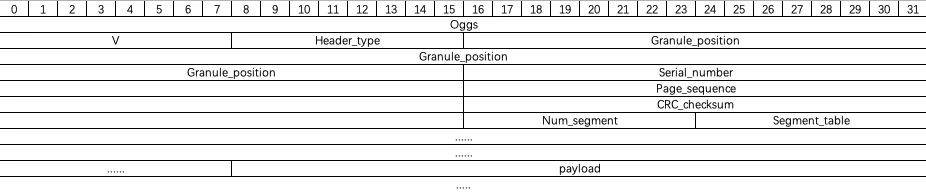

# ogg

ogg 是一种多媒体容器，可以包含很多种音视频格式，

大家可能所见的.ogg 的文件大都 ogg 的 vorbis 音频格式，全称是 OGGVorbis(oggVorbis)是一种音频压缩格式

是一种效果和 MP3 相媲美的音频，其实 ogg 是一个很强大的容器结构，xiph 提供的免费的视频 Theora 和音频 vorbis 都是开源免费的，都包含在 ogg 的容器中，

此外 ogg 也能包含很多其他音视频，如：flac，MP3 等，官网可以看看[http://www.xiph.org/](http://www.xiph.org/)！

完全免费、开放和没有专利限制

扩展名是".ogg"

> vorbis 算是 ogg 的默认封装内容了。ogg 的编码格式中没有其它位置标注算法格式，如果是 opus 的内容，只能仰仗文件后缀名来表示数据类型了。

# 编码格式 -- ogg 的标准容器格式


ogg 是以页（page）为单位将逻辑流组织链接起来，每个页都有 pageheader 和 pagedata。页头中有如下的定义：

1.  页标识：ASCII 字符，`0x4f 'O'` `0x67 'g'` `0x67 'g'` `0x53 'S'`，4 个字节大小，它标识着一个页的开始。
2.  版本 id：一般当前版本默认为零“0”，占 1 个字节。
3.  类型标识：标识当前的页的类型，占 1 个字节。

    - 0x01：本页媒体编码数据与前一页属于同一个逻辑流的同一个 packet，若此位没有设，表示本页是以一个新的 packet 开始的；
    - 0x02：表示该页为逻辑流的第一页，bos 标识，如果此位未设置，那表示不是第一页；
    - 0x04：表示该页位逻辑流的最后一页，eos 标识，如果此位未设置，那表示本页不是最后一页。

4.  granule_position：媒体编码相关的参数信息，8 个字节，
    - 对于音频流来说，它存储着到本页为止逻辑流在 PCM 输出中采样码的数目，可以由它来算得时间戳。
    - 对于视频流来说，它存储着到本页为止视频帧编码的数目。若此值为-1，那表示截止到本页，逻辑流的 packet 未结束。(小端)
5.  serial_number：当前页中的流的 id，4 个字节，它是区分本页所属逻辑流与其他逻辑流的序号，我们可以通过这个值来划分流。(小端)
6.  page_seguence_number：本页在逻辑流的序号，4 个字节。
7.  CRC_cbecksum：循环冗余效验码效验，4 个字节，用来效验每页的有效性。
8.  number_page_segments：给定本页在 segment_table 域中出现的 segement 个数，1 个字节。
9.  segment_table：从字面看它就是一个表，表示着每个 segment 的长度，取值范围是 0~255。
    - segment（1 个 segment 就是 1 个字节）可以得到 packet 的值，
    - 每个 packet 的大小是以最后一个不等于 255 的 segment 结束的，从页头中的 segment_table 可以得到每个 packet 长度，

举例：

如果一组 segment 依次顺序为

```hex
FF 45 FF FF FF 40 FF 05 FF FF FF 66
```

共 4 个 packet，含 12 个 segment，每个 packet 的长度是：

- FF 45【324】；
- FF FF FF 40【829】；
- FF 05【260】；
- FF FF FF 66【847】，

那么第一个 packet 的长度为 255+69 = 324,第二个 packet 大小 829，同理。

页头基本上就是由上述的参数组成，由此我们可以得到页头的长度和整个页的长度：

```
header_size = 27+number_page_segments ;（byet）
page_size = header_size +segment_table 中每个 segment 的大小;
```

# ogg 搭配的编码格式
<style>
table th:first-of-type {
    width: 10%;
}
</style>
音频：
|压缩类型|格式|说明|
|---|---|---|
|有损|Speek|以低比特率处理语音数据（〜2.1-32 kbit / s /通道）|
||Vorbis|处理中高级可变比特率（每通道 ≈16-500kbit / s）的一般音频数据|
||Opus：|以低和高可变比特率处理语音，音乐和通用音频（每通道 ≈6-510kbit / s）|
|无损|FLAC|处理文件和高保真音频数据|
|未压缩|OggPCM|处理未压缩的 PCM 音频,与 WAV 类似|

视频
|压缩类型|格式|说明|
|---|---|---|
|有损|Theora|基于 On2 的 VP3，它的目标是与 MPEG-4 视频（例如，使用 DivX 或 Xvid 编码），RealVideo 或 Windows Media Video 进行竞争。|
||Daala|正在开发的视频编码格式。|
||Dirac|由 BBC 开发的免费开放视频格式。使用小波编码|
||Tarkin|实验项目，现在过时的视频编解码器在 2000 年，2001 年和 2002 年开发利用离散小波变换的三个维度的宽度，高度和时间。在 Theora 成为视频编码的主要焦点之后，已被搁置（2002 年 8 月）。|
|无损|Dirac|Dirac 规范的一部分涵盖无损压缩。|
||Daala|正在开发的视频编码格式|

文本

|格式|说明|
|---|---|
|Writ|用于嵌入字幕或字幕的文本编解码器的草稿不完整，于 2007 年停止|
|CMML|用于定时元数据，字幕和格式的文本/应用编解码器|
|Annodex|CSIRO 开发的免费开源标准，用于注释和索引网络媒体。|
|oggKate|最初设计用于卡拉 OK 和文本的重叠编解码器，可以在 Ogg 中复用。|
