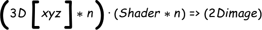
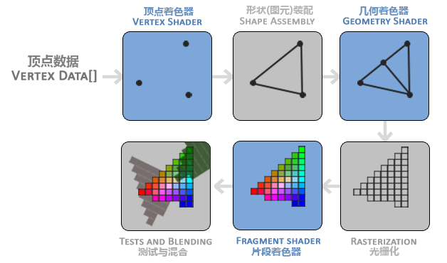

# 你好，三角形

在 OpenGL 中，任何事物都在 3D 空间中，而屏幕和窗口却是 2D 像素数组，这导致 OpenGL 的大部分工作都是关于把 3D 坐标转变为适应你屏幕的 2D 像素。

> 坐标和像素
>
> - 3D 坐标 是数学问题，采用数据与算法，保存在内存中
> - 3D 坐标 经过算法，才得到 2D 的投影平面，2D 坐标依然是算法与数据
> - 2D 坐标再次经过算法，才能得到 2D 像素，
>   - 而 2D 像素是这个点的近似值，2D 像素受到你的屏幕/窗口分辨率的限制。

## OpenGL 的图形渲染管线（Graphics Pipeline，大多译为管线）

实际上指的是一堆原始图形数据途经一个输送管道，期间经过各种变化处理最终出现在屏幕的过程。

图形渲染管线可以被划分为两个主要部分：

1. 第一部分把你的 3D 坐标转换为 2D 坐标，
2. 第二部分是把 2D 坐标转变为实际的有颜色的像素。

管线可以划分为几个阶段，而每个阶段又是特定的方法处理，所以很容易并行计算。

所以，就出现了 GPU，多核心，适宜并行计算。而哪些特定方法的小函数，小程序就叫做**着色器 Shader**

（3D 坐标（数据）* n）+ Shader*n => 2D 像素图像

<!-- tex -->
<!-- \left ( 3D\left [ xyz \right ] \ast n\right ) \cdot \left ( Shader \* n \right ) => \left ( 2D image \right ) -->

## OpenGL 着色器语言(OpenGL Shading Language, GLSL)

我们以数组的形式传递 3 个 3D 坐标作为图形渲染管线的输入，用来表示一个三角形:

- 这个数组叫做顶点数据(Vertex Data)；
  - 顶点数据是一系列顶点的集合。一个顶点(Vertex)是一个 3D 坐标的数据的集合。
  - 顶点数据是用顶点属性(Vertex Attribute)表示
- OpenGL 需要你去指定这些数据所表示的渲染类型.做出的这些提示叫做图元(Primitive),其中的几个：
  - GL_POINTS、
  - GL_TRIANGLES、
  - GL_LINE_STRIP。
- Shader 1, 管线的第一个部分是顶点着色器(Vertex Shader)，它把一个单独的顶点作为输入。顶点着色器主要的目的是把 3D 坐标转为另一种 3D 坐标（后面会解释），同时顶点着色器允许我们对顶点属性进行一些基本处理。
- Shader 2, 图元装配(Primitive Assembly)阶段将顶点着色器输出的所有顶点作为输入（如果是 GL_POINTS，那么就是一个顶点），并所有的点装配成指定图元的形状；本节例子中是一个三角形。
- Shader 3, 几何着色器(Geometry Shader)。几何着色器把图元形式的一系列顶点的集合作为输入，它可以通过产生新顶点构造出新的（或是其它的）图元来生成其他形状。例子中，它生成了另一个三角形。
- Shader 4, 光栅化阶段(Rasterization Stage)，这里它会把图元映射为最终屏幕上相应的像素，生成供片段着色器(Fragment Shader)使用的片段(Fragment)。
- Shader 5, 着色器(Fragment Shader)运行之前会执行裁切(Clipping)。裁切会丢弃超出你的视图以外的所有像素，用来提升执行效率。
- Shader 6, 最后一个阶段，我们叫做 Alpha 测试和混合(Blending)阶段
  - 检测片段的对应的深度（和模板(Stencil)）值，用它们来判断这个像素是其它物体的前面还是后面
  - 也会检查 alpha 值（alpha 值定义了一个物体的透明度）并对物体进行混合(Blend)。

> OpenGL 中的一个片段是 OpenGL 渲染一个像素所需的所有数据。

> 片段着色器的主要目的是计算一个像素的最终颜色，这也是所有 OpenGL 高级效果产生的地方。通常，片段着色器包含 3D 场景的数据（比如光照、阴影、光的颜色等等），这些数据可以被用来计算最终像素的颜色。
